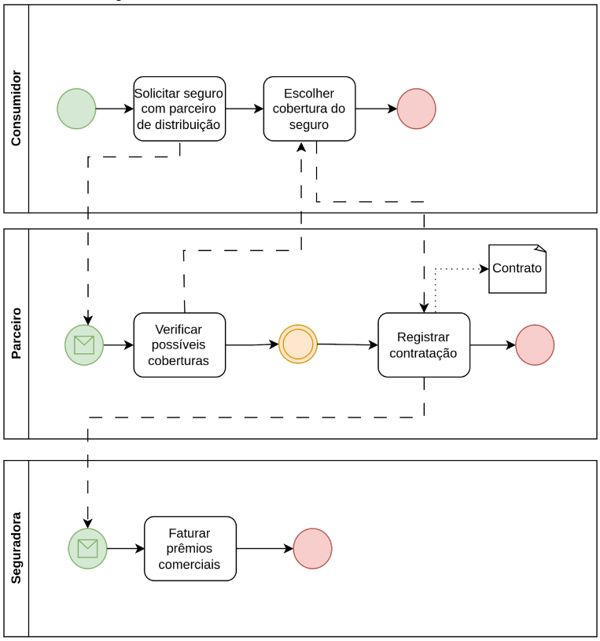
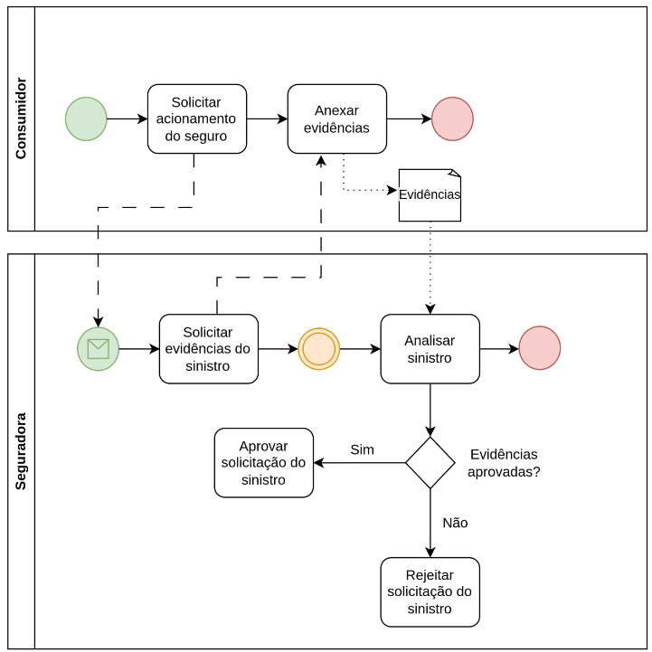

# Entendendo o Negócio do Projeto

-   Área de Domínio: Mercado de Seguros
-   Projeto: Sistema para promover transparência, eficiência e conformidade regulatória na operação de um Seguro Massificado.

# Descrição de Processos de Negócio

-   Seguradora
    -   Registro da contratação
    -   Gestão e faturamento
    -   Análise da solicitação de sinistro
-   Parceiros de distribuição (Corretores, Representantes e Estipulantes)
    -   Oferta do seguro para o consumidor
    -   Registro da contratação
-   Consumidor
    -   Contratação do seguro através de um dos parceiros de distribuição
    -   Acionamento do seguro

# BPMN

## Contratação

### Lista de Tarefas

1.  Solicitar seguro através do parceiro de distribuição
2.  Verificar possíveis coberturas de seguro
3.  Selecionar cobertura do seguro
4.  Registrar contratação
5.  Faturar prêmios

### Detalhe das Tarefas

<table>
    <tr>
        <th></th>
        <th>Nome da tarefa</th>
        <th>Dados de entrada</th>
        <th>Dados de saída</th>
        <th>Detalhamento da tarefa</th>
    </tr>
    <tr>
        <td>1</td>
        <td>Solicitar seguro através do parceiro de distribuição</td>
        <td>-</td>
        <td>Dados do produto</td>
        <td>O consumidor solicita uma cobertura de seguro para seu produto e informa dados do produto</td>
    </tr>
    <tr>
        <td>2</td>
        <td>Verificar possíveis coberturas de seguro</td>
        <td>Dados do produto</td>
        <td>Opções de cobertura disponíveis</td>
        <td>A seguradora verifica quais coberturas de seguro são aplicáveis ao produto informado pelo consumidor</td>
    </tr>
    <tr>
        <td>3</td>
        <td>Selecionar cobertura do seguro</td>
        <td>Opções de cobertura disponíveis</td>
        <td>Opção de cobertura selecionada</td>
        <td>O consumidor escolhe a cobertura de seguro que melhor se adapta às suas necessidades</td>
    </tr>
    <tr>
        <td>4</td>
        <td>Registrar contratação</td>
        <td>Opção de cobertura selecionada</td>
        <td>Contrato de seguro registrado</td>
        <td>O parceiro de distribuição formaliza a contratação do seguro com base na opção de cobertura selecionada pelo consumidor</td>
    </tr>
    <tr>
        <td>5</td>
        <td>Faturar prêmios</td>
        <td>Contrato de seguro registrado</td>
        <td>Fatura gerada</td>
        <td>A seguradora gera a fatura do prêmio do seguro com base no contrato registrado</td>
    </tr>
</table>

## Acionamento

### Lista de Tarefas

1.  Solicitar acionamento do seguro
2.  Solicitar evidências do sinistro
3.  Anexar evidências do sinistro
4.  Analisar sinistro
5.  Aprovar/rejeitar solicitação de sinistro

### Detalhe das Tarefas

<table>
    <tr>
        <th></th>
        <th>Nome da tarefa</th>
        <th>Dados de entrada</th>
        <th>Dados de saída</th>
        <th>Detalhamento da tarefa</th>
    </tr>
    <tr>
        <td>1</td>
        <td>Solicitar acionamento do seguro</td>
        <td>Dados do contrato de seguro</td>
        <td>Solicitação de acionamento registrada</td>
        <td>O consumidor solicita à seguradora o acionamento o seguro em caso de sinistro</td>
    </tr>
    <tr>
        <td>2</td>
        <td>Solicitar evidências do sinistro</td>
        <td>Solicitação de acionamento registrada</td>
        <td>Pedido de evidências enviado</td>
        <td>A seguradora solicita ao consumidor as evidências necessárias para a análise do sinistro</td>
    </tr>
    <tr>
        <td>3</td>
        <td>Anexar evidências do sinistro</td>
        <td>Pedido de evidências</td>
        <td>Evidências</td>
        <td>O consumidor fornece as evidências do sinistro, como fotos ou documentos</td>
    </tr>
    <tr>
        <td>4</td>
        <td>Analisar sinistro</td>
        <td>Evidências</td>
        <td>Resultado da análise</td>
        <td>A seguradora analisa as evidências fornecidas para determinar a validade do sinistro</td>
    </tr>
    <tr>
        <td>5</td>
        <td>Aprovar/rejeitar solicitação de sinistro</td>
        <td>Resultado da análise</td>
        <td>Decisão sobre o sinistro</td>
        <td>A seguradora aprova ou rejeita a solicitação de sinistro com base na análise das evidências</td>
    </tr>
</table>
