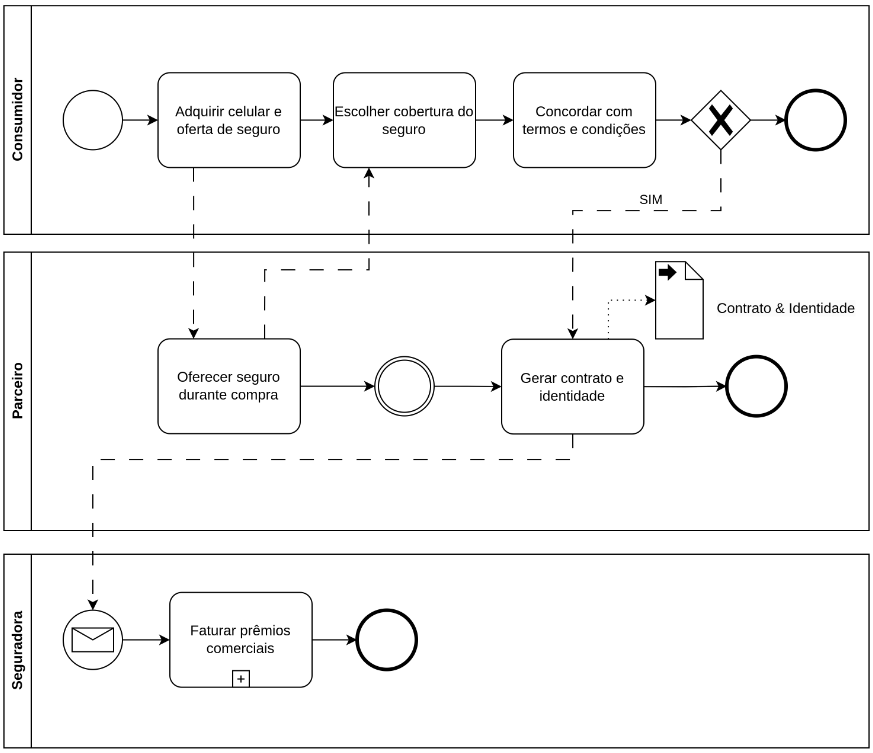
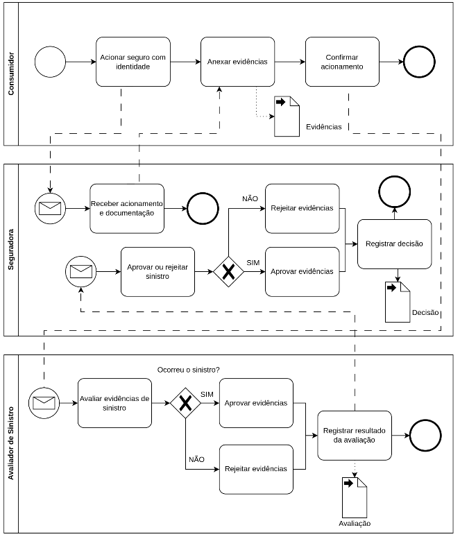

# BPMN

## Entendendo o Negócio do Projeto

<table>
    <tr>
        <th>Área de Domínio</th>
        <th>Projeto</th>
    <tr>
    <tr>
        <td>Mercado de Seguros</td>
        <td>Prova de conceito para implementação de Smart Contracts em uma plataforma de blockchain privada para seguro com cobertura contra roubo/furto</td>
    </tr>
</table>

## Descrição de Processos de Negócio

### Seguradora

-   Registro do contrato de seguro na blockchain
-   Recepção das solicitações de sinistro
-   Decisão sobre aprovação ou rejeição de sinistros
-   Registro das decisões na blockchain

### Parceiro de Distribuição

-   Oferta de seguro durante o processo de venda de produto
-   Registro da contratação do seguro na blockchain

### Consumidor

-   Aquisição de produto e contratação de seguro com parceiro de distribuição
-   Acionamento do seguro em caso de sinistro
-   Apresentação de documentação necessária (nota fiscal, boletim de ocorrência)

### Avaliador de Sinistros

-   Avaliação das evidências fornecidas pelo consumidor
-   Análise da autenticidade das evidências

## Modelagem

### Processo de Contratação

### Processo de Acionamento

### Lista de Tarefas e Detalhes

#### Consumidor

<table>
    <tr>
        <th></th>
        <th>Nome da tarefa</th>
        <th>Dados de entrada</th>
        <th>Dados de saída</th>
        <th>Detalhamento da tarefa</th>
    </tr>
    <tr>
        <td>1</td>
        <td>Adquirir celular e oferta de seguro</td>
        <td>-</td>
        <td>Dados do produto e oferta de seguro</td>
        <td>O consumidor adquire um celular e recebe a oferta de seguro durante o processo de compra</td>
    </tr>
    <tr>
        <td>2</td>
        <td>Escolher cobertura do seguro</td>
        <td>Oferta de seguro</td>
        <td>Cobertura do seguro escolhida</td>
        <td>O consumidor escolhe a cobertura de seguro que deseja adquirir, com base na oferta apresentada</td>
    </tr>
    <tr>
        <td>3</td>
        <td>Concordar com termos e condições</td>
        <td>Oferta de seguro</td>
        <td>Confirmação de concordância</td>
        <td>O consumidor concorda com os termos e condições do seguro oferecido</td>
    </tr>
    <tr>
        <td>4</td>
        <td>Acionar seguro com identidade</td>
        <td>Identidade de contrato e seguro</td>
        <td>Solicitação de acionamento registrada</td>
        <td>O consumidor utiliza sua identidade para acionar o seguro através da aplicação da seguradora</td>
    </tr>
    <tr>
        <td>5</td>
        <td>Anexar evidências</td>
        <td>Solicitação de acionamento</td>
        <td>Evidências de sinistro</td>
        <td>O consumidor anexa a nota fiscal do celular e o boletim de ocorrência do furto/roubo</td>
    </tr>
    <tr>
        <td>6</td>
        <td>Confirmar acionamento</td>
        <td>Evidências de sinistro</td>
        <td>Confirmação de acionamento</td>
        <td>O consumidor confirma o acionamento do seguro, finalizando o envio de todas as informações e evidências necessárias</td>
    </tr>
</table>

#### Parceiro de Distribuição

<table>
    <tr>
        <th></th>
        <th>Nome da tarefa</th>
        <th>Dados de entrada</th>
        <th>Dados de saída</th>
        <th>Detalhamento da tarefa</th>
    </tr>
    <tr>
        <td>1</td>
        <td>Oferecer seguro durante compra</td>
        <td>Dados do produto</td>
        <td>Oferta de seguro</td>
        <td>O parceiro de distribuição oferece o seguro ao consumidor durante o processo de compra do celular</td>
    </tr>
    <tr>
        <td>2</td>
        <td>Gerar contrato e identidade</td>
        <td>Cobertura do seguro escolhida, confirmação de concordância</td>
        <td>Contrato de seguro gerado, identidade criada</td>
        <td>O parceiro de distribuição gera o contrato de seguro e cria uma identidade</td>
    </tr> 
</table>

#### Seguradora

<table>
    <tr>
        <th></th>
        <th>Nome da tarefa</th>
        <th>Dados de entrada</th>
        <th>Dados de saída</th>
        <th>Detalhamento da tarefa</th>
    </tr>
    <tr>
        <td>1</td>
        <td>Receber acionamento e documentação</td>
        <td>Solicitação de acionamento e evidências</td>
        <td>Dados do sinistro registrados</td>
        <td>A seguradora recebe o acionamento e a documentação do consumidor</td>
    </tr>
    <tr>
        <td>2</td>
        <td>Aprovar ou rejeitar sinistro</td>
        <td>Resultado da avaliação</td>
        <td>Decisão sobre o sinistro</td>
        <td>A seguradora toma a decisão final de aprovar ou rejeitar o sinistro baseado na avaliação do avaliador de sinistros</td>
    </tr>
    <tr>
        <td>3</td>
        <td>Registrar decisão</td>
        <td>Decisão sobre o sinistro</td>
        <td>Decisão registrada</td>
        <td>A seguradora registra a decisão final, tornando a informação acessível a todos os participantes autorizados</td>
    </tr>
</table>

#### Avaliador de Sinistros

<table>
    <tr>
        <th></th>
        <th>Nome da tarefa</th>
        <th>Dados de entrada</th>
        <th>Dados de saída</th>
        <th>Detalhamento da tarefa</th>
    </tr>
    <tr>
        <td>1</td>
        <td>Avaliar evidências de sinistro</td>
        <td>Dados do sinistro</td>
        <td>Resultado da avaliação</td>
        <td>O avaliador de sinistros avalia as evidências apresentadas pelo consumidor para verificar a validade do sinistro</td>
    </tr>
<tr>
    <td>2</td>
    <td>Registrar resultado da avaliação</td>
    <td>Resultado da avaliação</td>
    <td>Resultado registrado</td>
    <td>O avaliador registra o resultado da avaliação, informando a seguradora sobre a validade do sinistro</td>
    </tr> 
</table>
