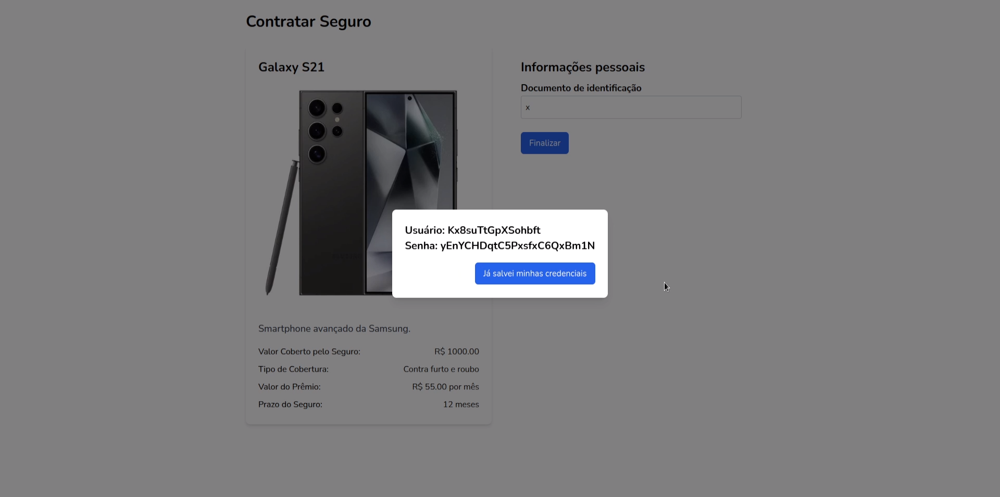
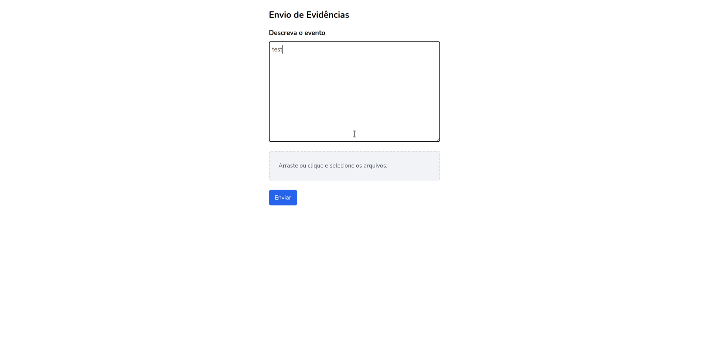

# Especificação e Análise de Requisitos de Software

## 1 Modelo de Processo de Software

Desenvolvimento Incremental
-   Abordagem utilizada nos métodos ágeis
-   Resiliente a mudanças durante o processo de desenvolvimento
-   Mais rápido e fácil de realizar
-   Obtenção contínua de feedbacks

## 2 Stakeholders do Software

Com a centralização da informação de forma descentralizada na plataforma blockchain privada, a comunicação entre os agentes do processo será eficiente. Não sendo mais necessário transferir dados entre si.

O departamento comercial da seguradora conseguirá faturar em um prazo menor os prêmios, quando um novo contrato for estabelecido.
Os intermediários não precisarão transferir dados do contrato para a seguradora.
O segurado terá maior agilidade e transparência após o acionamento do contrato.
O analista de evidências terá as evidências a sua disposição de forma mais rápida.

-   Diretores
-   Gerentes
-   Dpto. Comercial Seguradora
-   Dpto. Comercial/Adm. dos intermediários
-   Corretores
-   Segurado
-   Analista de evidências
-   Equipe de TI responsável pela manutenção do sistema

## 3 Técnica de Coleta de Requisitos 

Análise de Documentos:
-   Documentos sobre processos de negócio
-   Legislação relacionada

## 4 Requisitos do Software 

-   Contratação do Seguro
-   Acionamento do Seguro
-   Avaliação do Sinistro
-   Decisão Final

### Requisitos Funcionais

-   RF1 - O sistema deve permitir que o consumidor final adquira um seguro de celular contra roubo/furto por meio de um parceiro de distribuição.
-   RF2 - O consumidor deve poder visualizar os detalhes do seguro, incluindo o período de cobertura e o prêmio a ser pago.
-   RF3 - O sistema deve gerar um contrato de seguro na rede blockchain após a confirmação do consumidor.
-   RF4 - Uma credencial única deve ser emitida para autenticar o consumidor em processos futuros de sinistro.
-   RF5 - O consumidor deve poder acionar o seguro através da aplicação cliente da seguradora, utilizando as credenciais emitidas no momento da contratação.
-   RF6 - O sistema deve permitir que o consumidor anexe evidências, como a NF do celular e o BO de roubo/furto.
-   RF7 - O acionamento deve ser registrado na blockchain para ser avaliado posteriormente.
-   RF8 - O avaliador de evidências deve ter a opção de aprovar ou rejeitar a solicitação de sinistro com base nas evidências fornecidas.
-   RF9 - O sistema deve registrar a decisão do avaliador de evidências (aprovação ou rejeição) na blockchain.
-   RF10 - O responsável pela decisão final deve poder aprovar ou rejeitar a indenização com base na avaliação do sinistro.
-   RF11 - A decisão final de aprovação ou rejeição deve ser registrada na rede blockchain.

### Requisitos Não Funcionais

-   RNF1 - As credenciais emitidas para o consumidor devem ser criptografadas com o algoritmo AES-256, garantindo proteção de dados em todos os pontos de armazenamento.
-   RNF2 - Toda a comunicação entre a aplicação cliente e a blockchain deve ser protegida usando TLS.
-   RNF3 - O sistema deve garantir que apenas usuários autenticados possam acessar os dados pessoais e sinistros, com uma taxa de sucesso de 100% em testes de autorização.
-   RNF4 - O tempo máximo de resposta para a geração de contratos, registro de acionamentos e avaliação de sinistros deve ser inferior a 2 segundos para 95% das transações.
-   RNF5 - O sistema deve suportar até 1k transações por segundo em ambientes de pico, mantendo uma latência média abaixo de 500ms.
-   RNF6 - O sistema deve ser compatível com a plataforma blockchain Hyperledger, com 100% de sucesso em testes de integração.
-   RNF7 - A aplicação cliente deve suportar integração com, no mínimo, 1 parceiro de distribuição.
-   RNF8 - O sistema deve garantir 99,9% de disponibilidade mensal.
-   RNF9 - Todos os registros na blockchain devem ser 100% imutáveis, auditáveis e devem poder ser consultados.
-   RNF10 - A aplicação cliente deve permitir que 95% dos usuários completem o processo de acionamento do seguro em menos de 1 minuto.
-   RNF11 - Os usuários devem conseguir anexar documentos, de no máximo 10Mbps, em até 10 segundos, e o sistema deve fornecer feedback em tempo real para 100% dos envios de arquivos.
-   RNF12 - O frontend em React deve ser compatível com os navegadores Google Chrome, Firefox e Edge nas suas versões estáveis mais recentes, com uma taxa de conformidade de 100% nos testes de compatibilidade.

### Regras de Negócio

-   RN1 - Apenas consumidores que compram um celular através de parceiros de distribuição podem adquirir o seguro.
-   RN2 - O seguro oferecido é válido apenas para roubo ou furto do dispositivo móvel.
-   RN3 - Documentos comprobatórios, como a nota fiscal e o boletim de ocorrência, são obrigatórios para acionar o seguro.
-   RN4 - O avaliador pode rejeitar a solicitação se as evidências não forem suficientes ou estiverem incorretas.
-   RN5 - A seguradora tem a autoridade final para aprovar ou rejeitar a indenização, mesmo após a aprovação inicial do avaliador de evidências.
-   RN6 - Se a solicitação for rejeitada, o consumidor deve ser notificado com os motivos da rejeição.

## 5 Protótipos 

#### Cliente final no Parceiro de distribuição

#### Cliente final na Seguradora

#### Avaliador de Evidências

#### Seguradora

## 6 Histórias de Usuário 

<table border="1" cellpadding="10" cellspacing="0">
  <thead>
    <tr>
      <th>História</th>
      <th>Quem (Who)</th>
      <th>O quê (What)</th>
      <th>Por quê (Why)</th>
      <th>Critérios de Aceitação</th>
    </tr>
  </thead>
  <tbody>
    <tr>
      <td>Contratação de Seguro</td>
      <td>Como um <strong>consumidor final</strong></td>
      <td>Eu quero <strong>contratar um seguro contra roubo/furto</strong> para o celular que estou adquirindo</td>
      <td>Para que eu possa <strong>proteger meu bem</strong> e acionar o seguro em caso de roubo ou furto</td>
      <td>
        <ul>
          <li>O consumidor deve visualizar as condições do seguro (período de cobertura e valor do prêmio).</li>
          <li>O consumidor deve poder confirmar a contratação do seguro após aceitar os termos.</li>
          <li>Um contrato de seguro deve ser gerado automaticamente na rede blockchain.</li>
          <li>Uma credencial de autenticação deve ser emitida para o consumidor.</li>
        </ul>
      </td>
    </tr>
    <tr>
      <td>Acionamento do Seguro</td>
      <td>Como um <strong>segurado</strong></td>
      <td>Eu quero <strong>acionar o seguro</strong> em caso de roubo ou furto do meu celular</td>
      <td>Para que eu possa <strong>iniciar o processo de indenização</strong> e ser compensado pela perda</td>
      <td>
        <ul>
          <li>O consumidor deve acessar a aplicação da seguradora utilizando as credenciais emitidas.</li>
          <li>O consumidor deve anexar os documentos comprobatórios (nota fiscal e boletim de ocorrência).</li>
          <li>O acionamento do seguro deve ser registrado na blockchain para posterior análise.</li>
        </ul>
      </td>
    </tr>
    <tr>
      <td>Avaliação de Evidências</td>
      <td>Como um <strong>avaliador de evidências</strong></td>
      <td>Eu quero <strong>avaliar os documentos</strong> enviados pelo segurado</td>
      <td>Para que eu possa <strong>determinar se as evidências são conformes</strong></td>
      <td>
        <ul>
          <li>O avaliador deve visualizar os documentos e evidências anexadas pelo segurado.</li>
          <li>O avaliador deve ter a opção de aprovar ou rejeitar o sinistro com base nas evidências fornecidas.</li>
          <li>A decisão de aprovação ou rejeição deve ser registrada na blockchain.</li>
        </ul>
      </td>
    </tr>
    <tr>
      <td>Decisão Final do Sinistro</td>
      <td>Como um <strong>responsável pela decisão final</strong></td>
      <td>Eu quero <strong>aprovar ou rejeitar</strong> a indenização do sinistro previamente avaliado</td>
      <td>Para que eu possa <strong>garantir que o sinistro foi analisado corretamente</strong> antes da compensação</td>
      <td>
        <ul>
          <li>O responsável deve visualizar a decisão do avaliador e as evidências anexadas.</li>
          <li>O responsável deve poder registrar a decisão final na blockchain (aprovação ou rejeição da indenização).</li>
          <li>O segurado deve ser notificado sobre a decisão final.</li>
        </ul>
      </td>
    </tr>
    <tr>
      <td>Segurança das Credenciais</td>
      <td>Como um <strong>consumidor final</strong></td>
      <td>Eu quero que <strong>minhas credenciais de acesso</strong> à aplicação da seguradora sejam <strong>seguras</strong></td>
      <td>Para que eu possa <strong>proteger minhas informações pessoais</strong> e garantir que somente eu posso acionar o seguro</td>
      <td>
        <ul>
          <li>As credenciais devem ser geradas e criptografadas com o algoritmo AES-256.</li>
          <li>As credenciais devem ser armazenadas de forma segura e acessíveis apenas pelo consumidor autenticado.</li>
        </ul>
      </td>
    </tr>
    <tr>
      <td>Desempenho no Registro de Sinistros</td>
      <td>Como um <strong>consumidor final</strong></td>
      <td>Eu quero que o <strong>registro do acionamento do meu seguro</strong> seja <strong>rápido</strong></td>
      <td>Para que eu possa <strong>finalizar o processo sem atrasos</strong> e garantir uma resposta imediata</td>
      <td>
        <ul>
          <li>O registro do acionamento na blockchain deve ser concluído em até 2 segundos para 95% das transações.</li>
          <li>O sistema deve ser capaz de suportar até 1k transações por segundo sem comprometimento da latência.</li>
        </ul>
      </td>
    </tr>
    <tr>
      <td>Facilidade de Uso na Aplicação</td>
      <td>Como um <strong>consumidor final</strong></td>
      <td>Eu quero que a <strong>interface da aplicação de seguro</strong> seja <strong>fácil de usar</strong></td>
      <td>Para que eu possa <strong>contratar e acionar o seguro de forma rápida</strong> e sem complicações</td>
      <td>
        <ul>
          <li>95% dos consumidores devem ser capazes de completar o processo de contratação ou acionamento do seguro em menos de 1 minuto.</li>
          <li>O processo de envio de documentos deve ser intuitivo e o sistema deve fornecer feedback imediato sobre o status de cada envio.</li>
        </ul>
      </td>
    </tr>
  </tbody>
</table>
